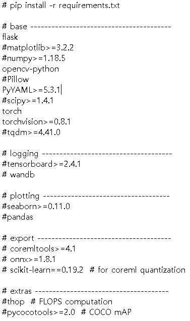

## 화재 탐지 시스템 (Fire Detect System)

### Git Organization Link

> https://github.com/Multicampus-Last-Seven

### 주제

>  Yolo 모델을 사용한 화재 조기 탐지

### 기능

- Yolo AI 모델을 사용한 CCTV 영상의 화재 탐지
- CCTV Monitoring Web Page 제공
- 화재 탐지 시 Web Page 알림 및 신고
- 화재 탐지 시 건물 창문 일시 개방 (3D 모델로 구현)

### 개발환경/기술스택

- Desktop
  - Pycharm 20.3.1
- RaspberryPi4
  - Python 3.7
- Ubuntu
  - Anaconda3 / Python 3.7.6
  - Django 3.1.5
  - MariaDB 10.3.11

### 실행방법

- AI 서버
  FDS_AI_Server.py 실행 > python3 FDS_AI_Server.py
- 라즈베리파이
  FDS_Pi.py 실행 > python3 FDS_Pi.py
- 클라우드 서버
  Django 실행

### 필요 패키지

